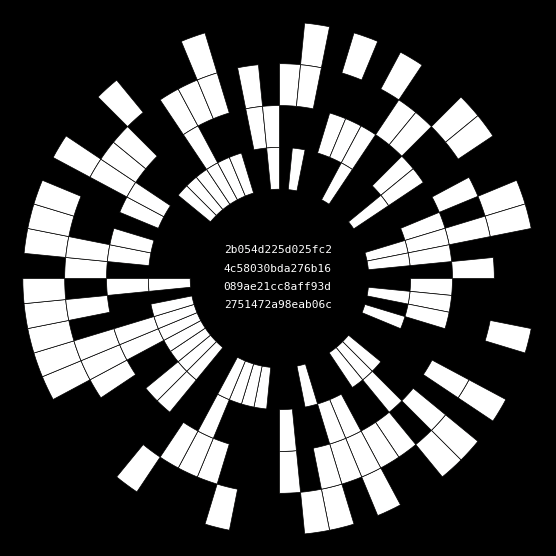

# HashJing

**HashJing** is a generative-art project that explores the boundary between randomness and order through a visual language derived from cryptographic hashes. The work draws on binary logic, modern cryptography, and the symbolism of the *Yì Jīng*—the ancient Chinese *Book of Changes*.

<figure markdown>

</figure>

*Mandala generated from the SHA-256 hash of “HashJing”*  
`0x2b054d225d025fc24c58030bda276b16089ae21cc8aff93d2751472a98eab06c`

## What it does

HashJing converts cryptographic hash strings—typically **256-bit** (SHA-256) and optionally **160-bit** (Ethereum address format)—into **mandalas**: circular diagrams formed by sectors and concentric rings.  
Each sector corresponds to one hex character; each ring captures one of that character’s four bits. Thus a 256-bit hash yields **64 sectors**, while a 160-bit hash yields **40**. The mapping is fully deterministic: **one hash → one form**.

Default hashing uses SHA-256; **Keccak-256** (the Ethereum variant) is available as an option.

**Address support** – any 160-bit Ethereum address (wallet or contract) can be visualized as a 40-sector mandala.

A mandala becomes a frame for contemplating entropy, symmetry, rarity, and the visible face of probability.

## Core ideas

* Binary patterns as a visual language  
* Randomness rendered observable  
* Parallels with the 64 hexagrams of the *Yì Jīng*  
* The hash as a seal—an imprint of choice  
* Complete determinism

## Project layout

```text
├── README.md                    # 1. Entry point
├── WhitePaper.ipynb             # 2. Technical deep-dive
├── ArtManifesto.md              # 3. Artistic statement
├── FamousBlockchainHashes.ipynb # 4. Gallery of landmark hashes
├── index.html                   # 5. Live demo (HTML + Canvas)
├── LICENSE-MIT.md               # MIT license for source code
├── LICENSE-CCBYNC.md            # CC BY-NC 4.0 for visuals & docs
├── hash_utils/
│   ├── __init__.py
│   └── base_hash.py             # Hex-to-binary conversion & drawing logic
└── pic/
    ├── hashjing_mandala.png     # Example mandala
    └── yi_circle.jpg            # 64-hexagram diagram
```

## Further reading

* [**ArtManifesto.md**](https://github.com/DataSattva/hashjing/blob/main/ArtManifesto.md) – philosophical background; HashJing as “the shape of randomness.”

* [**WhitePaper.ipynb**](https://github.com/DataSattva/hashjing/blob/main/WhitePaper.ipynb) – technical details, mapping rules, statistical features.

* [**FamousBlockchainHashes.ipynb**](https://github.com/DataSattva/hashjing/blob/main/FamousBlockchainHashes.ipynb) – mandalas of Genesis blocks, landmark contracts, and other culturally significant hashes.

## Demo page

`index.html` is a self-contained HTML/Canvas demo. Each reload generates a new random 256-bit hash and draws its mandala—no user input required.

**No user input required**—just reload the page to see a new mandala.
Perfect for demonstrating deterministic randomness and testing the visual rhythm of hashes.

[**Open the HashJing demo**](https://datasattva.github.io/hashjing/)

Custom hashes can be supplied via the code examples in [WhitePaper.ipynb](https://github.com/DataSattva/hashjing/blob/main/WhitePaper.ipynb).

## License

- Code: [MIT License](https://github.com/DataSattva/hashjing/blob/main/LICENSE-MIT.md).
- Visual outputs and documentation: [CC BY-NC 4.0](https://github.com/DataSattva/hashjing/blob/main/LICENSE-CCBYNC.md).

You're free to use, remix, and redistribute the project — including generated art — for **non-commercial purposes**, with proper attribution.


