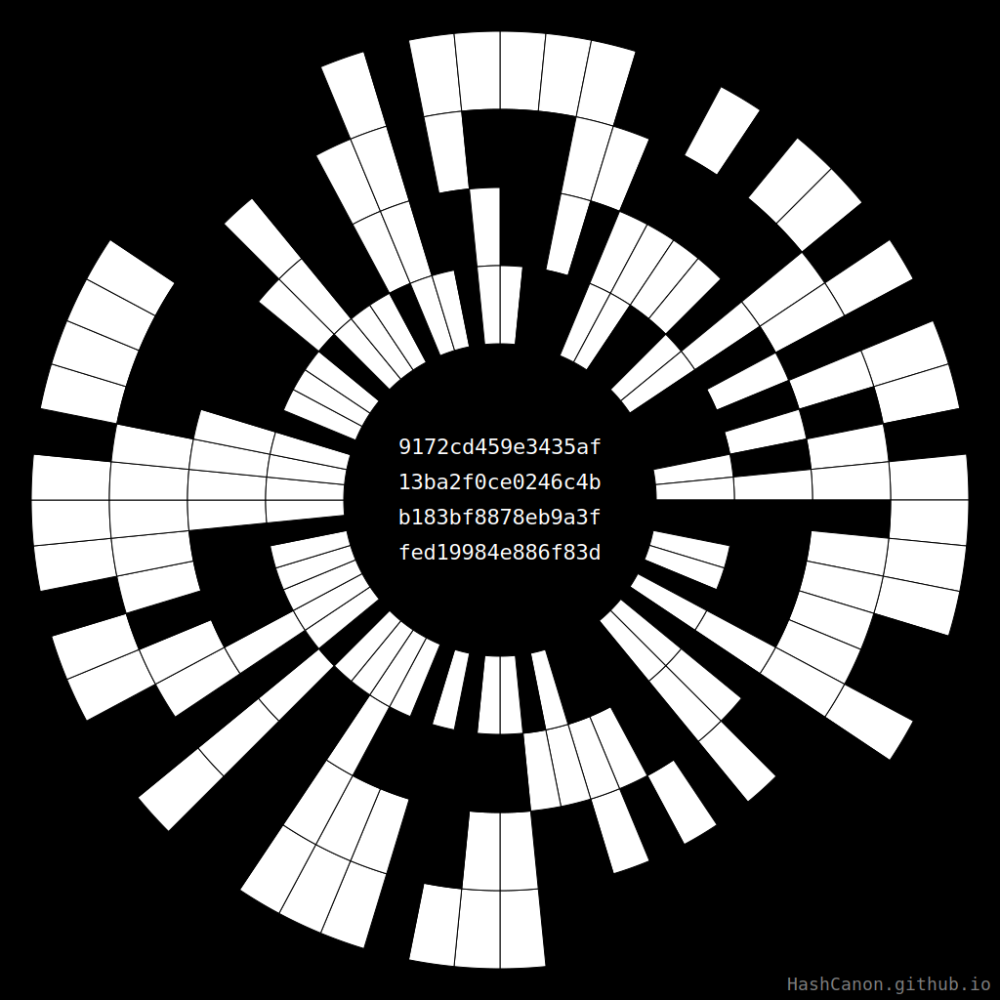

# HashCanon  
> *The Canon of Every Hash*

[**▶︎ Launch the HashCanon Generator**](https://hashcanon.github.io/generator/)

**HashCanon** is an open-source toolkit and aesthetic inquiry at the point where generative art meets modern cryptography and East Asian symbolism.  
By applying binary logic and ideas drawn from the *Yì Jīng*—better known in the West as the *I Ching* or *Book of Changes* (literally the classical *Canon of Changes*)—it turns any hash into a deterministic visual glyph, revealing the hidden patterns inside cryptographic entropy.

<figure markdown>

</figure>

*Mandala generated from the SHA-256 hash of “HashCanon”*  
`0x2b054d225d025fc24c58030bda276b16089ae21cc8aff93d2751472a98eab06c`

## What it does

HashCanon converts cryptographic hash strings—typically **256-bit** (SHA-256) and optionally **160-bit** (Ethereum-address format)—into **mandalas**: circular diagrams composed of radial sectors and concentric rings.  
Each sector maps to one hex character; each ring maps to one of that character’s four bits. Thus a 256-bit hash yields **64 sectors**, while a 160-bit hash yields **40**. The mapping is fully deterministic: **one hash → one form**.

Default hashing uses SHA-256; **Keccak-256** (the Ethereum variant) is available as an option.  
Any 160-bit Ethereum address (wallet or contract) can be visualised as a 40-sector mandala.

### Why it matters

HashCanon is more than a hash visualiser; it is a meditation on chance and order.

One and the same 256-bit string of pure entropy is deterministically transformed into a coherent visual sign, a *canon*.  
*Where is the boundary between entropy and canon?* At what moment does raw data become a cultural or symbolic object—inside the SVG function, in the viewer’s perception, or already in the immutability that cryptography confers?

To frame these questions, HashCanon leans on two complementary ideas:

* **The visual principles of the *I Ching*** — a generative grammar of change that inspires the mandala’s radial logic.  
* **The Daoist polarity from Wújí → Tàijí** — the leap from the undivided to the first structured difference, echoed here as entropy crystallising into image.

By merging these insights with modern cryptography, HashCanon places contemporary data within a long dialogue on pattern, probability and meaning.

### Core ideas

* Binary patterns as a visual language  
* Randomness rendered observable  
* Parallels with the 64 hexagrams of the *Yì Jīng*  
* The hash as a seal—an imprint of choice  
* Complete determinism  

## Quick start

1. Open the demo: <https://hashcanon.github.io/generator/>  
2. Paste a hash (or type any text).  
3. Click **Generate** to view an SVG mandala.  
4. Download as **SVG** or **PNG**, or explore the *Features of Order* panel:  
   * Balanced / unbalanced bits  
   * Passage count  
   * Rare sealed states  

## Learn more

| Resource | Link |
|----------|------|
| White Paper – algorithms and maths | [WhitePaper.ipynb](./WhitePaper.ipynb) |
| Art Manifesto – philosophy | [ArtManifesto.md](./ArtManifesto.md) |
| Famous Blockchain Hashes gallery | [FamousBlockchainHashes.ipynb](./FamousBlockchainHashes.ipynb) |
| Developer guide | [CONTRIBUTING.md](./CONTRIBUTING.md) |

## Community & Support

Questions, ideas or bug reports?  
Open a thread in [**HashCanon Discussions**](https://github.com/HashCanon/HashCanon/discussions) and let’s talk!

For a detailed list of HashCanon contacts and resources, see the page [**Contacts and Resources**](https://hashcanon.github.io/resources/).

For a live generator and examples, see the [**HashCanon Generator**](https://hashcanon.github.io/generator/)

## License

* Code – MIT  
* Visuals and documentation – CC BY-NC 4.0
